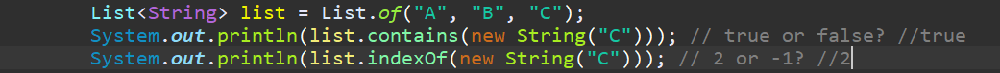

# 一、Java简介  
Java介于编译型语言和解释型语言之间。编译型语言如C、C++，**代码是直接编译成机器码执行**，但是不同的平台（x86、ARM等）CPU的指令集不同，因此，需要编译出每一种平台的对应机器码。解释型语言如Python、Ruby没有这个问题，可以由解释器直接加载源码然后运行，代价是运行效率太低。而Java是**将代码编译成一种“字节码”**，它类似于抽象的CPU指令，然后，针对不同平台编写虚拟机，**不同平台的虚拟机负责加载字节码并执行**，这样就实现了“一次编写，到处运行”的效果。当然，这是针对Java开发者而言。对于虚拟机，需要为每个平台分别开发。为了保证不同平台、不同公司开发的虚拟机都能正确执行Java字节码，SUN公司制定了一系列的Java虚拟机规范。从实践的角度看，JVM的兼容性做得非常好，低版本的Java字节码完全可以正常运行在高版本的JVM上。

随着Java的发展，SUN给Java又分出了三个不同版本：  
- Java SE：Standard Edition
- Java EE：Enterprise Edition
- Java ME：Micro Edition(嵌入式设备)

三者之间的关系：

    

**学习路线**
1. 首先要学习Java SE，掌握Java语言本身、Java核心开发技术以及Java标准库的使用；

2. 如果继续学习Java EE，那么Spring框架、数据库开发、分布式架构就是需要学习的；

3. 如果要学习大数据开发，那么Hadoop、Spark、Flink这些大数据平台就是需要学习的，他们都基于Java或Scala开发；

4. 如果想要学习移动开发，那么就深入Android平台，掌握Android App开发。

**名词解释**：  
- JDK：Java Development Kit
- JRE：Java Runtime Environment  

具体关系图示：  

    

JRE就是运行Java字节码的虚拟机，要编译成Java字节码，就需要JDK。  

- JSR规范：Java Specification Request
- JCP组织：Java Community Process  
- RI：Reference Implementation
- TCK：Technology Compatibility Kit  

一个JSR规范发布时，为了让大家有个参考，还要同时发布一个“参考实现RI”，以及一个“兼容性测试套件TCK”

# 二、程序基础
为什么是语法简要？因为java既能在不同平台上运行，又是一个面向对象的语言，它是介于编译型语言和解释性语言之间的一门语言，所以面向对象方面和c#很像，基础的语法和c又很像，因此在这里只强调和c、c#之间的不同之处。

## 2.1 变量类型
变量类型分为两类：
1. 值类型(整型、浮点、字符型、布尔型)
2. 引用类型(除了上述之外的所有，例如String)
### 2.1.1 字符串
字符串也可以像python一样通过运算符`+`拼接。  
### 2.1.2 数组
数组是引用类型，其数组里的内容既可以是值类型，也可以是引用类型。  
数组的遍历：
- c中的基本for循环
- c#中的foreach循环。例如：for (String string : args)

## 2.2 常量
不可变的量，不是用`const`而是用`final double\int`来声明常量。

## 2.3 输入
输入需要调用的包：  
- `java.util.Scanner`  
调用方法:`Scanner scanner = new Scanner(System.in);`
- `scanner.nextLine()`读字符串，返回字符串
- `scanner.nextInt()`读int，返回int

# 三、面向对象
## 3.1 字段
java中字段的概念和c#相同，但是没有c#中关于setter和getter的语法糖，只能通过`setPropName`和`getPropName`方法来编辑字段。

## 3.2 方法参数
方法参数的数量可以是任意个。
- 可变参数：`类型...`来定义，相当于数组类型，传递数量不定的参数
- 参数绑定：
    - 值类型参数绑定：这时候是值的赋值，双方各自后续修改不相互影响。
    - 引用类型绑定：这时候是引用的传递，参数和接收方都指向同一个对象，因此改变时双方相互影响。  

可以参考[例子](https://www.liaoxuefeng.com/wiki/1252599548343744/1260452774408320)去看。

## 3.3 构造方法
和c#基本一样。
- 带参数的构造方法
- 不带参数的构造方法
- 参数不同的构造方法(代码复用)

## 3.4 方法重载
就是上述提到的第三点，方法名相同，参数列表不同的方法，都在同一个类中。

## 3.5 继承
`extends`  
例如`class Student extends Person`

# 四、集合
java标准库Collection提供了集合类，提供了常见的集合类接口(除了map之外)。  
那Java.util提供了以下接口，支持泛型：  
- List
- Set
- Map

## 4.1 List
**list主要的用法**：
- 在末尾添加一个元素：boolean add(E e)
- 在指定索引添加一个元素：boolean add(int index, E e)
- 删除指定索引的元素：E remove(int index)
- 删除某个元素：boolean remove(Object e)
- 获取指定索引的元素：E get(int index)
- 获取链表大小（包含元素的个数）：int size()  
- 判断元素是否存在：boolean  contains()
- 获取索引： int indexOf(Object o)

**list分类**：
- 第一种是`ArrayList`
- 第二种`LinkedList`  
其中第一种最常用。  

**创建list**：  
- new一个
- List.of(T...) 可以填充泛型(可迭代),或者直接填充元素。

**遍历list**：  
- for(iterator)
- foreach

**list和array的转换：**  
list->array:  
- toarray()
- toarray(T[]) 传入类型相同的array
- toArray(IntFunction<T[]> generator)

**array到list**：
- List.of
- Arrays.asList(T...)  

注：由这种方法而来的list是只读不写的list，不可以进行add。

## 4.2 实现equals
在上述提到的`contains`中，是通过`equals`方法来将传入的参数和list中的每一个元素作比较从而进行判断的。  
而我们之所以能够对`String`，`Integer`这些对象做判断，是因为java标准库已经实现了这些类的equals方法。    
  
从上图来说，`contains`方法并不是比较的两个实例是不是指向同一个引用。  
`list`内部并不是通过`==`来判断，而是通过`equals`来判断。(个人猜测:引用类型通过`hashcode`判断，值类型通过`==`判断)  

`equals`需要满足的性质:
- 自反性（Reflexive）：对于非null的x来说，x.equals(x)必须返回true；
- 对称性（Symmetric）：对于非null的x和y来说，如果x.equals(y)为true，则y.equals(x)也必须为true；
- 传递性（Transitive）：对于非null的x、y和z来说，如果x.equals(y)为true，y.equals(z)也为true，那么x.equals(z)也必须为true；
- 一致性（Consistent）：对于非null的x和y来说，只要x和y状态不变，则x.equals(y)总是一致地返回true或者false；
- 对null的比较：即x.equals(null)永远返回false。  

程序模板：
1. 确定哪些字段相同则实例就相同
2. 判断实例类型是否一致
2. 在判断引用和值是否相同  

`public boolean equals(Object o) {
    if (o instanceof Person p) {
        return Objects.equals(this.name, p.name) && this.age == p.age;
    }
    return false;
}`

## 4.3 Map
语法:`Map<K,V>`，初始化:`Map<String, Person> map = new HashMap(100)`其中可以选择指定map的容量，也可以不指定，默认为0。  
Map常用`HashMap`类  
**常用方法**：
- `put`
- `V get`
- `boolean containsKey`

遍历`Map`:
- 遍历key `for (String key : map.keySet())`
- 遍历value `for (Value value :  map.values())`
- 遍历key-value `for (Map.Entry<String, Integer> entry : map.entrySet())`

## 4.4 重写equals和hascode
**正确使用map的前提**：  
1. 如果实例作为`key`必须正确覆写`equals()`方法，相等的两个`key`实例调用`equals()`必须返回`true`；
2. 作为`key`的对象还必须正确覆写`hashCode()`方法，且`hashCode()`方法要严格遵循以下规范：  
    - 如果两个对象相等，则两个对象的`hashCode()`必须相等；
    - 如果两个对象不相等，则两个对象的`hashCode()`尽量不要相等。

`Map`的`key`之间判断是否相等和`List`一样。对象相等：如果是自己定义对象就要定义好相等的条件，实现`equals`。  
编写`equals`和`hashCode`的原则是：
- `equals`中用到的字段，**必须要**在`hashCode`中计算
- `equals`中没有用到的字段，**一定不要**在`hashCode`中计算  

自己定义的对象如果重写`hashCode`，通常通过`Objects.hash()`进行计算。

## 4.5 其他map类

# 五、Java核心类
## 5.1 String
**字符串的特性**：  
- 不可变类型，当字符串被初始化以后就没法改变，改变的是字符串引用
- 比较字符串相等必须用`equals`而不是==

**常用方法**：  
- `trim()`和`strip()`去除首尾空格
- `isEmpty()`和`isBlank()` 判断空字符
- `replace`和正则替换字符串
- `split()`分割为数组
- `join(CharSequence s1,CharSequence... elem)`用s1拼接字符串数组
- `format()`格式化字符串，`%d`,`%f`等等

**类型转换**:  
- `String.valueOf`把基本类型和引用类型转换为字符串
- `Integer.parseInt`字符串转int，相近的有`Boolean.parseBoolean`转boolean，还有float等等
- `String.toCharArray`是`string`转`char[]`，`new String(array)`是`array`转`string`

**字符编码**： 
- 字符编码有`Unicode`，`UTF-8`，`ASCII`等
- 现在java使用`Unicode`来表示字符
- 编码转换就是`String`和`byte[]`之间的转换
- 转换时尽量使用`UTF-8`编码

## 5.2 StringBuilder
java可以通过`+`拼接字符串。  
考察以下代码：
`for (int i = 0; i < 1000; i++) {s = s + "," + i;}`  
这样可以直接拼接字符串，但是每次循环的时候都会重建对象，然后扔掉旧的对象，这样会浪费内存，也会影响效率。  

特性：  
- 可变对象，可以用来高效拼接字符串。
- 支持**链式操作**，链式操作的返回值是它本身

## 5.2 包装类型
我们知道java的数据类型分两种：  

- 基本类型：`byte`，`short`，`int`，`long`，`boolean`，`float`，`double`，`char`
- 引用类型：所有`class`和`interface`类型

如果我们想把一个基本类型视为引用类型，就用到了包装类型。  

| 基本类型	| 对应的引用类型| 
|:----|:----|
| boolean	| java.lang.Boolean| 
| byte	| java.lang.Byte| 
| short	| java.lang.Short| 
| int	| java.lang.Integer| 
| long	| java.lang.Long| 
| float	| java.lang.Float| 
| double	| java.lang.Double| 
| char	| java.lang.Character| 

特性：  
- 都是不可变的类
- 比较要用`equals`而不是`==`
- `Integer.parseInt("100", 16)`按`16`进制解析`100`

## 5.3 枚举类
枚举的用处：用来定义常量。  
特性：
- 枚举虽然是类，但是定义的每个常量在JVM中都是唯一实例
- 只能通过`enum`定义实例，不能`new`
- 枚举的比较可以不用`equals`而用`==`
- 可以为`enum`编写构造函数，字段和方法
- 构造函数要是`private`,字段是`final`

常用方法：  
- `name`返回常量名称
- `ordinal()`返回常量定义顺序，从0开始(无实质意义)

# 六、反射
什么叫做反射？reflection是指Java在运行期间可以拿到对象的全部信息。  

如果方法的参数是object类，那么如果传入一个特定的类，那么怎么访问该类的属性和方法？这就是反射要解决的问题。  
## 6.1 Class类
特性：  
- `Class`类是一个名叫`Class`的类，**每一个Java对象都有一个`Class`的实例属性**。  
- 这个`Class`实例是JVM自动创建的，与我们的编码无关。  
- 我们可以通过获取到`Class`实例，进而获取`class`的所有信息，这个过程就叫做反射。  

获取`Class`实例的方法：  
1. 直接通过一个class的静态变量class获取：`String.class`等
2. 如果我们有一个实例变量，可以通过该实例变量提供的`getClass()`方法获取：`s.getClass()`等
3. 如果知道一个class的完整类名，可以通过静态方法`Class.forName()`获取：

# 七、线程
java的线程库`Thread`
## 7.1 创建新线程
1. `new`构造的时候可以选择传入task参数，也可以选择不传入
2. `start`  

例如`Thread t = new Thread(() -> {System.out.println("start new thread!");});t.start();`  

线程的启用必须调用start方法，start会自动调用run方法，run方法由JVM调用，何时调用我们并不清楚，由CPU执行。

## 7.2 线程状态
- New：新创建的线程，尚未执行；
- Runnable：运行中的线程，正在执行run()方法的Java代码；
- Blocked：运行中的线程，因为某些操作被阻塞而挂起；
- Waiting：运行中的线程，因为某些操作在等待中；
- Timed Waiting：运行中的线程，因为执行sleep()方法正在计时等待；
- Terminated：线程已终止，因为run()方法执行完毕。

## 7.3 线程优先级
java线程可以设定优先级，设定方法`Thread.setPriority(int n) // 1~10, 默认值5`。  
10最高，1最低。

## 7.4 中断线程
调用`interrupt()`方法  
线程可以被中断，但推荐使用不？？？？  

线程中可以使用`volatile`关键字，使得线程之间的变量可以共享。该声明使得变量被线程修改后立马写入到主存当中，线程读取变量的时候也从主存读取，而非缓存。

## 7.5 守护线程
当所有的线程结束运行时，JVM才会退出，但如果需要无限循环的线程怎么办？  
把他定义为守护线程，守护线程不结束，JVM仍然可以退出。  

创建守护线程：  
前面和普通线程相同，只要在`start`之前调用`setDaemon(true)`标记线程为守护线程即可。  
另外：守护线程不可以进行IO操作，因为JVM会关闭IO资源。   

## 7.6 线程同步
### 7.6.1 加互斥锁
`synchronized`关键字对一个对象进行加锁。  
使用方法：
1. 找出使用共享变量的代码块
2. 选择共享示例作为锁对象
3. 使用`synchronized(lockObject) { ... }`  

不需要锁的操作：原子操作  
- 基本类型(long和doubel除外)的赋值
- 引用类型的赋值  

其余都不是原子操作。  
通过引用类型，可以巧妙地把非原子操作(多个值类型的赋值)变为原子操作(引用类型的赋值)。如下图中就把x，y的赋值转换为了数组的赋值。  

    

# 八、数据库
## 8.1 JDBC
JDBC(Java DataBase Connectivity)是一个访问关系型数据库的常用接口。JDBC通过各个数据库厂商提供的访问数据库的接口来对数据库进行访问(所有复杂网络通信都封装在驱动程序中)。   
JDBC特性：  
- 各数据库厂商使用相同的接口，Java代码不需要针对不同数据库分别开发；
- Java程序编译期仅依赖java.sql包，不依赖具体数据库的jar包；
- 可随时替换底层数据库，访问数据库的Java代码基本不变。

## 8.2 JDBC查询
JDBC查询参数
- `String JDBC_URL = "jdbc:mysql://localhost:3306/learnjdbc?useSSL=false&characterEncoding=utf8"`;
- `String JDBC_USER = "root"`;
- `String JDBC_PASSWORD = "password"`;  

其中URL是远程数据库的URL，`useSSL=false`是指不适用安全socket连接，USER指用户名，PASSWORD指密码。  

常用的对象(类)、方法：  
- `Connection`表示数据库的连接。
- `Statement`表示连接状态。
- `DriverManager.getConnection`返回一个静态的连接状态`Statement`，只能执行静态的语句，不能根据condition和user input来动态的更改连接状态。
- `PreparedStatement`动态的SQL连接状态。
- `Statement.executeQuery`执行查询语句，返回一个结果集合`ResultSet`
- 通过`ResultSet.next`方法可以遍历结果集合，方法返回boolean值

另外，由于JDBC是非常昂贵的连接资源，强烈建议使用`try(resource)`的方法来自动释放JDBC资源。  

**SQL注入**：  
可以理解为一种SQL攻击，因为SQL参数往往从方法参数传入，一旦方法参数更改，那么SQL执行的语句可能就会发生更改，造成难以想象的破坏。  
例如`"SELECT * FROM user WHERE login='" + name + "' AND pass='" + pass + "'"`字符串内插的方式，如果`name`和 `pass`参数传入错误，也无法判断登录口令是否正确。  

**解决办法**：使用`PreparedStatement`，因为它使用`?`作为占位符，  并且把变量连同SQL语句传入，确保SQL语句相同，仅仅是占位符不同。  
设置占位符的值:`setObject()`,返回对象仍然是`ResultSet`。

## 8.3 JDBC更新
数据库操作CRUD增删查改。  
三者仅仅在SQL语句上有所不同，其余的java语句并无差别。  
- `PreparedStatement.executeUpdate`在数据库上执行更新。
- 返回值为更新的行数。  

文章还提到了返回自增键，不过暂时没有测试成功。

## 8.4 JDBC事务
数据库事务（Transaction）是由若干个SQL语句构成的一个操作序列，有点类似于Java的synchronized同步。数据库系统保证在一个事务中的所有SQL要么全部执行成功，要么全部不执行，即数据库事务具有ACID特性：
- Atomicity：原子性
- Consistency：一致性
- Isolation：隔离性
- Durability：持久性

例如转账问题，不能转出方转出成功，而转入方转入失败，否则账户就会凭空减少一部分资金。  
执行事务本质上是把多条SQL语句包裹在一个事务中执行。  

## 8.5 Batch
在批量插入或者更新代码中，为了减少频繁的SQL访问，需要进行`batch`处理。  
- `for`循环依次添加参数
- `addBatch()`将参数都添加到batch中
- `executeBatch`执行batch

# 附、命令行运行
java可以通过命令行进行编译，然后执行java程序。
## 3.1 Windows
如下图所示，进入项目文件的src下面，然后在这里运行cmd。也可以通过cd命令进入文件夹下。

    

执行命令：  

1. `javac Main.java`编译
2. `java Main`运行

如果声明了package，那么命令改变，cmd的运行路径不变：
1. `javac hello\Main.java`
2. `java hello\Main`  

hello为包名，根据你自己的包名进行替换。