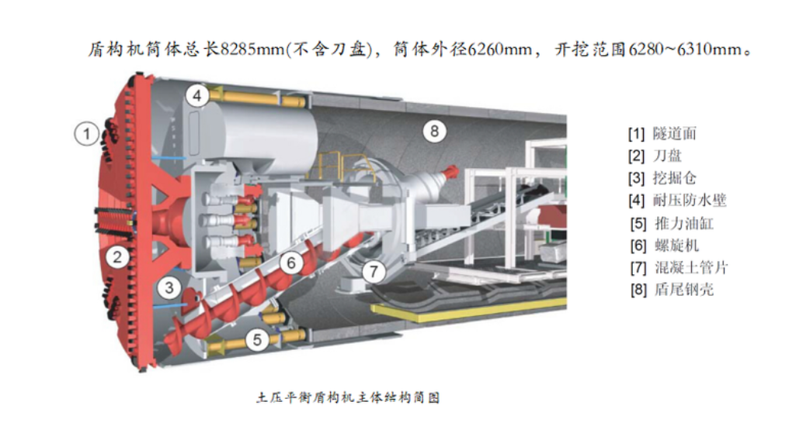
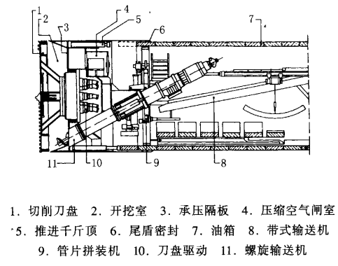
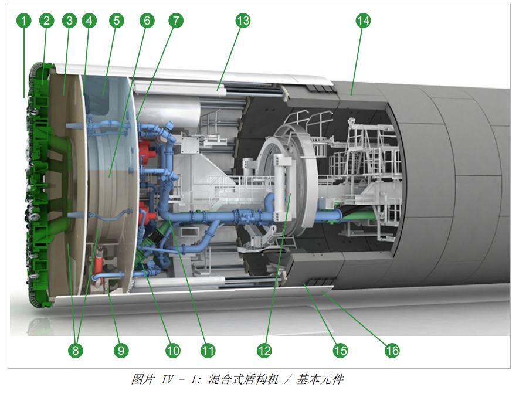
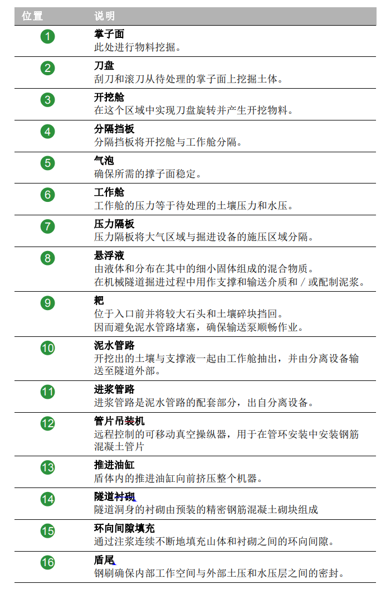
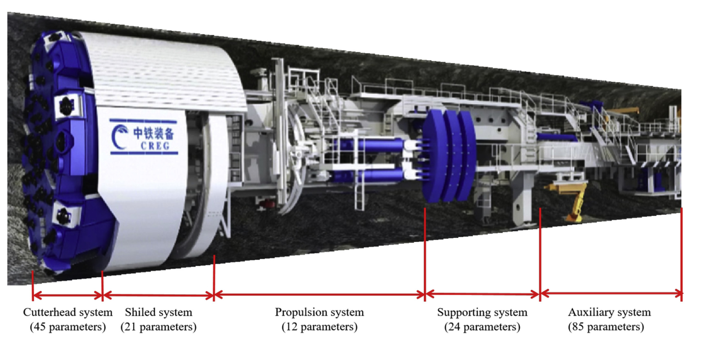
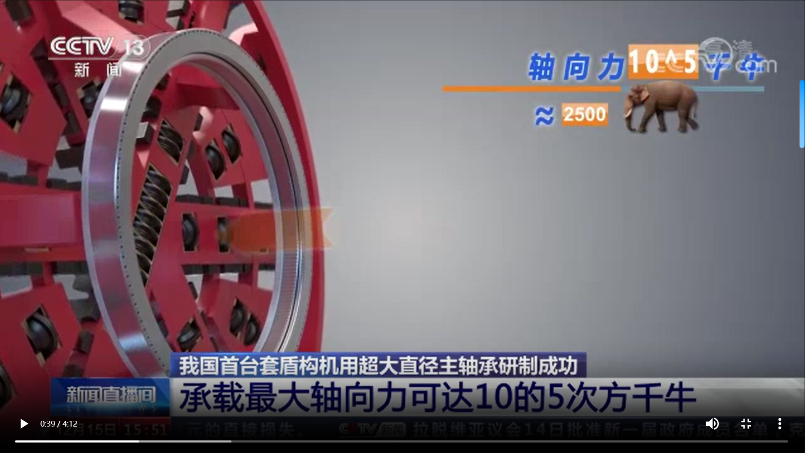

<!--
 * @Author: Jeason 19938943480@163.com
 * @Date: 2023-08-10 14:34:17
 * @LastEditors: Jeason 19938943480@163.com
 * @LastEditTime: 2023-08-16 10:18:33
 * @FilePath: \undefinedc:\Users\User\Desktop\NoteBook\盾构.md
 * @Description: 这是默认设置,请设置`customMade`, 打开koroFileHeader查看配置 进行设置: https://github.com/OBKoro1/koro1FileHeader/wiki/%E9%85%8D%E7%BD%AE
-->
# 盾构

# 一、盾构机概述
## 1.1 盾构机结构图

    

## 1.2 盾构机分类
主流盾构机可以分为三大类：土压平衡式、泥水平衡式、复合式
### 1.2.1 土压平衡式盾构机  

    

土压盾构又称削土密闭式或泥土加压式盾构。它的前端有一个全断面切削刀盘(1)，切削刀盘的后面有一个贮留切削土体的密封舱(2)，在密封舱中心线下部装置长筒形螺旋输送机(11)，输送机一头设有出入口，如上图所示。  

原理：**刀盘旋转切削下来的土壤通过刀盘上的开口进人泥土室(现在一般是全封闭)，与泥土室内的可塑土浆混合或被搅拌混合，盾构千斤顶的推力通过承压隔板传递到泥土室内的泥土浆上，由泥土浆的压力作用于开挖面，以平衡开挖面处的地下水压和土压。从而保持开挖面的稳定**。  

挖掘过程中的土压信息会提供更多的开挖面稳定控制的所需信息，土压通过改变盾构千斤顶的推进速度或推螺旋输送机的旋转速度而增减。  

**土质改良**：土压平衡式盾构机用开挖出的土料作为支撑开挖面稳定的介质，对作为支撑介质的土料要求为具有良好的塑性变形，软稠度，内摩擦角小及渗透率小。一般土质不符合要求，要进行改良，改良的方法通常为加水，膨润土，粘土，CMC，聚合物，粘土和膨润土悬浮液，泡沫等，根据土质情况选用。  

土压平衡式盾构机最适合工作的土层：有软稠度的粘质粉土和粉砂，冲积粘土、洪积粘土、砂质土、砂、砂砾、卵石等土层

### 1.2.2 泥水平衡盾构机  
泥水式盾构机是通过有一定压力的泥浆来支撑稳固开挖面；由旋转刀盘、悬臂刀头或水力射流等进行土体开挖；开挖下来的土料与泥水混合以泥水状态由泥浆泵进行输运。泥水式盾构机适用于各种松散地层，有无地下水均可。  

**稳定开挖面的机理**：以泥水压力来抵抗开挖面的土压力和水压力以保持开挖面的稳定，同时，控制开挖面变形和地基沉降；在开挖面形成弱透水性泥膜‚保持泥水压力有效作用于开挖面。  

在开挖面，随着加压后的泥水不断渗入土体，泥水中的砂土颗粒填入土体孔隙中，可形成渗透系数非常小的泥膜，（膨润土悬浮液支撑时形成一滤饼层）。而且，由于泥膜形成后减小了开挖面的压力损失，泥水压力可有效地作用于开挖面，从而可防止开挖面的变形和崩塌，并确保开挖面的稳定。因此，在泥水式盾构机施工中，控制泥水压力和控制泥水质量是两个重要的课题。为了保持开挖面稳定，必须可靠而迅速地形成泥膜，以使压力有效地作用于开挖面。

### 1.2.3 混合式盾构机
混合式的组合方式有多种，例如压缩空气盾构/敞开式盾构、泥浆式盾构/敞开式盾构、土压平衡盾/构敞开式盾构、泥浆式盾构/土压平衡盾构、敞开式盾构/泥浆式盾构/土压平衡盾构等，下图是一个土压/泥水式平衡盾构。

    

    

可以实现土压式和泥水式的切换

## 1.3 盾构组成
液压推力系统、刀盘驱动系统、姿态定位系统、启动制动系统、螺旋输送系统、辅助控制系统(冷却水系统、注浆系统和盾尾密封系统)、管片拼装系统等  

按照组成位置来分：

    

刀盘系统、盾构系统、推进系统、支持系统、辅助系统

盾构的驱动系统采用液压系统来驱动，因为可携带电力系统能力不足。  

### 1.3.1 盾构刀盘
刀盘系统中可以使用的刀为滚刀和切刀，滚刀主要对于岩体进行破碎，切刀则主要对软土层进行切削。

## 1.2 盾构机作业过程
1. 推进
2. 停止
3. 拼装管片  

[我国自主研发的智能盾构机，可以同步进行推进和拼装管片](https://www.chinanews.com.cn/sh/2021/04-18/9457492.shtml)

# 二、盾构机常见故障
## 2.1 机械系统故障
### 2.1.1 刀盘故障

刀盘是盾构机的“芯片”
1. 磨损
2. 磨损也可以分为很多磨损

可以做的点:  
1. 磨损预测，避免过早换刀和长时间刀具使用带来严重磨损和连锁故障。

### 2.1.2 轴承故障
盾构机主轴承：  

    

  

[我国自主研发主轴承](https://www.cas.cn/yw/202212/t20221215_4858052.shtml)

轴承故障类型：  
1.

诊断方法，主要研究方向：特征提取和分析。  
可以做的点：同时识别故障位置和严重程度。

轴承故障需要的信号：振动信号(主要)。  

### 2.1.3 传动系统故障

## 2.2 液压系统故障
故障类别：
1. 液压元件泄漏
2. 液压油粘度过高或过低
3. 电磁阀失效等

## 2.3 整体运行状态评估
可行性？怎么去分析

## 2.4 施工风险

# 三、运动控制
## 3.1 自动驾驶

## 3.2 姿态控制
运行角度、运行方向

姿态失准：

# 四、名词解释
## 4.1 盾构名词
1. 推进率/掘进率:盾构机的掘进率是指在单位时间内盾构机能够挖掘的隧道长度或进展距离。掘进率 = 掘进距离 / 时间。其中，掘进距离是在一定时间内盾构机实际挖掘的隧道长度，时间是这段时间的持续时间。
2. 推进速度:等于贯入度*刀盘转速
3. 扭矩
4. 刀盘转速

## 4.2 运行名词
1. 贯入度：贯入度是指在地基土中用重力击打贯入体时，贯入体进入土中的深度。贯入体可以是桩，也可以是一定规格的钢钎。贯入度一般是指锤击桩每10击进入的深度mm，用（mm/10击）表示，如在强风化花岗岩中最后贯入度（6．0吨的锤）一般为20～50（mm/10击）。进行贯入测试的目的，是通过贯入度判断地基土的软硬程度，从而确定桩基或地基土的承载能力。

## 4.3 地质名词
